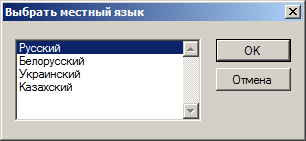

Ещё один клавиатурный тренажёр?
==============================================================================

Есть одна разновидность людей, работающих за компьютером по 8 и более часов в
день - это IТ-профессионалы, инженеры и другие технические специалисты.
Тексты, с которыми им приходится иметь дело, далеко не всегда представляют
собой тексты на правильном, литературном языке. В основном это различного рода
технические, технологические тексты, такие как: исходные тексты программ и
скриптов; файлы в форматах различных интернет протоколов; конфигурационные
файлы и файлы разнообразных данных в текстовом виде.

Для этих технологических текстов характерно то, что в них, могут быть
перемешаны латинские символы и символы местного языка (кириллицы в нашем
случае). Кроме того, эти тексты часто содержат большое количество цифровой
информации и большое количество специальных символов, в том числе таких,
которые в литературных текстах не встречаются. В технологических тестах могут
присутствовать слова, целиком набранные в верхнем регистре (в режиме
CapsLock).

Вследствие этого IT-специалистам нужны особенные навыки работы с клавиатурой:
нужно быстро и автоматически переключаться между разными раскладками
клавиатуры (с кириллицы на латиницу и обратно), нужно уверенно переключаться в
режим CapsLock, необходимо активно использовать спецсимволы, не говоря уже о
печати цифровой информации.

<em>Примечание. Кстати, написание всевозможных "смайликов" и других ascii-art
объектов - это тоже требует определённых специфических навыков. 8))</em>

IT-специалисты используют клавиатуру не только для работы с текстами. В их
работе активно используются специальные, функциональные клавиши, нажатие на
которые не соответствует никаким символам (например, верхний ряд из 12-ти
функциональных клавиш). Для профессионала, важно работать с этими клавишами
также как с остальными, т.е. вслепую (не глядя на клавиатуру). Для тренировки
этого навыка тоже нужен специальный тренажёр.

Существует большое количество прекрасных клавиатурных тренажёров, но они могут
помочь в развитии необходимых IT-специалистам навыков лишь отчасти. Поэтому
был сделан специализированный тренажёр, включающий специфические упражнения, и
позволяющий пользователю самостоятельно добавлять новые и модифицировать
существующие упражнения.

Начало работы
==============================================================================

Сразу после установки <a href="http://twidlle.com/ru/typinglab/download.html">
дистрибутива программы</a> вы можете начинать упражняться, набирая
предложенную вам последовательность символов.

Для каждой набранной вами строки будет подсчитана достигнутая скорость набора
символов и количество допущенных ошибок. После того как вы наберёте одну
строку, вам будет предложена следующая, и так далее. Каждую набранную строчку,
будем считать одним упражнением, а последовательность непрерывно выполненных
вами упражнений - одной тренировкой.

В ходе тренировки вы можете узнавать результаты самого удачного, выполненного
вами упражнения, а также скорость набора, усреднённую по всем выполненным за
эту тренировку упражнениям (меню Тренировка | Результаты... Ctrl + A).

Примечание. В любой момент вы можете прервать выполнение упражнения и начать
заново новое. Новое упражнение - это заново сформированная и предложенная вам
для набора строка символов.

Прервать тренировку и начать новую тоже можно. Статистические, рекордные и
усреднённые показатели при этом начнут отслеживаться заново, с нуля.

План тренировки
==============================================================================

Предположим, вам надо поднять скорость и точность набора цифровой информации.
В этом случае вам надо, чтобы тестовая строка содержала только цифры и ничего
более. Или другой пример: у вас трудности с набором текста, где перемешаны
кириллица и латиница. В этом случае вам нужны соответствующие тестовые строки.

Управлять тем, какие строки будут вам предложены в качестве упражнений можно,
выбирая различные планы тренировки. План тренировки - это правило, по которому
формируется строка, которую вы должны набрать в процессе выполнения
упражнения. Её содержание и структура должны соответствовать тем навыкам,
которые вы хотите совершенствовать.

Вы можете использовать планы тренировки, поставляемые с дистрибутивом
TypingLab, а можете формировать свои, специфические планы тренировок
(возможно, отталкиваясь, модифицировать существующие).

Примеры планов тренировки
==============================================================================

С программой поставляется небольшой набор планов тренировки. Главная цель этих
планов - служить примером для составления ваших собственных планов. Как
составлять свои планы описано ниже, а пока рассмотрим примеры уже имеющихся,
готовых планов.

<ol> <li><strong>Буквы местного языка </strong> 

Самое простое упражнение, включающее набор букв только на одном (местном) языке. Все буквы набираются в
нижнем регистре. Упражнение полезно на начальном этапе тренировок для
заучивания расположения клавиш и правильного использования пальцев.

План "Латинские буквы" - это тоже самое, но буквы латинские. </li>

<li><strong>Буквы местного языка, включая заглавные</strong>

Немного усложняем тренировку, за счёт написания некоторых слов с заглавной
буквы. Вам придётся активно использовать клавишу Shift.

План "Латинские буквы, включая заглавные" - это тоже самое, но буквы
латинские. </li>

<li><strong>Латинские буквы с режимом CapsLock</strong>

В технических текстах часто используются слова, набранные целиком в верхнем
регистре клавиатуры. Использование клавиши Shift в этом случае не эффективно.
При наборе таких слов удобнее переключаться в режим CapsLock. Это упражнение
позволит вам тренировать этот навык. </li>

<li><strong>Числа </strong>

Тренировка по набору цифр. Вам будут предложены для набора целые числа без
дробной части. Числа разной длинны (от одной до 6 цифр в числе).

На основе этого плана вы можете составлять свой план. Например, план по набору
десятизначных телефонных номеров. Просто установите значения параметров плана
MinWordLength и MaxWordLength равными десяти.

<li><strong>Числа с десятичной дробной частью </strong>

Тренировка по набору чисел с десятичной дробной частью. С качестве разделителя
дробной части используется запятая.

Если вы используете в качестве разделителя точку, замените значение параметра
плана DecimalPointCharacter с запятой на точку. </li>

<li><strong>Спецсимволы и цифры </strong>

Тренировка по набору цифр и специальных символов. Большинство специальных
символов (это ~`!@#$%^&*()_+=-[]{}|\;':",./<>?) набираются при использовании
стандартной (латинской) раскладки клавиатуры. Но для набора некоторых символов
вам придётся переключиться в местную раскладку. Например, для набора русского
символа номера № или украинского символа гривны ₴. </li>

<li><strong>Комплексная тренировка </strong>

Тренировка, включающая буквы местного языка и латиницу, цифры, специальные
символы. Встречаются слова с заглавными буквами и слова в режиме CapsLock.
</li>

<li><strong>Управляющие и функциональные клавиши </strong>

При использовании этого плана тренировки вы можете тренироваться в слепом
использовании специальных клавиш. В упражнение включены клавиши F1...F12,
Escape, Tab, CapsLock, Ctrl, Backspace, Enter, Menu,Insert, Delete, Home, End,
PageDown, PageUp, Scroll, Pause,

Клавиши Alt, Shift, PrintScreen, Windows в это упражнение не включены. </li>
</ol>

Cобственный план тренировки
==============================================================================

В каталоге, куда вы установили приложение, есть файл WorkoutPlans.xml.
Редактируя этот файл, вы можете составлять собственные планы или
модифицировать существующие.

План - это набор следующих параметров:

<ol> <li><strong>Name</strong> - Имя плана тренировки. Произвольная строка.
Обязательный параметр. </li>

<li><strong>Decription</strong> - Подробное описание плана тренировки.
Необязательный параметр. </li>

<li><strong>ExerciseLength</strong> - Длина тестовой строки. Обязательный
параметр. </li>

<li><strong>MaxWordLength</strong> - Максимальная длина слова. Обязательный
параметр.

Тестовая строка разбивается на слова одиночными пробелами. Длина слов
выбирается случайно в диапазоне от MinWordLength до MaxWordLength. </li>

<li><strong>MinWordLength</strong> - Минимальная длина слова. Необязательный
параметр. Значение по умолчанию: 1.

Тестовая строка разбивается на слова одиночными пробелами. Длина слов
выбирается случайно в диапазоне от MinWordLength до MaxWordLength. </li>
<li><strong>LocalWordPercent</strong> - Доля слов в местной раскладке
клавиатуры. Необязательный параметр. Значение по умолчанию: 0.

Каждое слово тестовой строки состоит из символов набираемых в одной
клавиатурной раскладке (или целиком латиница или целиком кириллица). Выбор
раскладки для следующего слова осуществляется случайным образом, так чтобы
соблюдалась заданная в этом параметре доля слов в местной раскладке, заданная
в процентах. </li>

<li><strong>DigitsPercent</strong> - Доля цифр в словах. Необязательный
параметр. Значение по умолчанию: 0.

В составе слов могут быть цифры. Будет ли следующий символ цифрой,
определяется случайно, так чтобы соблюдалась заданная в этом параметре доля
цифр в словах, заданная в процентах. </li>

<li><strong>SymbolPercent</strong> - Доля специальных символов в словах.
Необязательный параметр. Значение по умолчанию: 0.

В составе слов могут быть специальные символы. Будет ли следующий символ
специальным, определяется случайно, так чтобы соблюдалась заданная в этом
параметре доля специальных символов в словах. </li>

<li><strong>CapitalizedWordPercent</strong> - Доля слов с заглавной буквы.
Необязательный параметр. Значение по умолчанию - 0.

Первые буквы в составе слов могут быть заглавными. Будет ли первая буква слова
заглавной, определяется случайно, так чтобы соблюдалась заданная в этом
параметре доля слов с заглавной буквы. </li>

<li><strong>CapsLockWordPercent</strong> - Доля слов, набранных в режиме
CapsLock. Необязательный параметр. Значение по умолчанию - 0.

Некоторые слова набираются в режиме CapsLock. Будет ли слово набрано в режиме
CapsLock, определяется случайно, так чтобы соблюдалась заданная в этом
параметре доля слов набранных в режиме CapsLock. </li>

<li><strong>DecimalPointNumberPercent</strong> - Доля чисел с десятичной
точкой. Необязательный параметр. Значение по умолчанию - 0.

Если вы тренируетесь в наборе чисел, то некоторые из них (или все) могут иметь
дробную десятичную часть. Доля таких чисел регулируется этим параметром. Если
вы совсем не хотите, чтобы дробные числа встречались, задайте ноль. Если вы
хотите, чтобы все числа имели дробную часть, задайте 100. </li>

<li><strong>DecimalPointCharacter</strong> - Символ-разделитель десятичной
дробной части числа. Необязательный параметр. Значение по умолчанию - символ
точки.

В качестве разделителя дробной десятичной части чаще всего используется точка,
но в некоторых странах (в том числе в России) принято использовать запятую.
Этот параметр позволить уточнить ваши планы на этот счёт. </li>

<li><strong>FunctionalKeysPercent</strong> - Доля управляющих и функциональных
клавиш. Необязательный параметр. Значение по умолчанию - 0.

В обычных планах по набору текста этот параметр не заполняется и по умолчанию
равен нулю, и поэтому в ходе тренировок управляющие и функциональные клавиши
вам набирать не предлагается. Но вы можете добавить их в тест с помощью этого
параметра. Например, создать специальный план по набору только таких клавиш.
</li> </ol>

Местный язык
==============================================================================

Программа TypingLab может быть полезна при работе несколькими местными
раскладками клавиатуры (не считая стандартной English(US) раскладки). Выбор
местного языка делается через меню "Параметры | Местный язык..."

В настоящее время поддерживаются следующие языки: 

<ul>
<li>Русский</li> 
<li>Белорусский</li> 
<li>Украинский</li>  
<li>Казахский</li> 
<li>Болгарский</li> 
<li>Молдавский (кириллица)</li> 
<li>Сербский (кириллица)</li> 
</ul>

Вы можете добавить свой местный язык, отредактировав конфигурационный файл
LocalLanguagesxml. Для этого надо добавить новую секцию LocalLanguage с двумя
параметрами:

<ol> <li><strong>Letters</strong> - Этот параметр содержит список всех букв
местного языка в нижнем регистре. </li>

<li><strong>Symbols</strong> - Этот параметр содержит список всех остальных
символов (не букв), которые возможно набрать на клавиатуре для вашего местного
языка. </li> 
</ol>

==============================================================================

Тренировка TypingLab
--------------------------------------------------------
                Дата тренировки: 2015-08-30 11:32:02
                План тренировки: Буквы английского языка
                   Местный язык: Русский
           Выполнено упражнений: 0
   Результат лучшего упражнения: 0 симв./мин, 0 ошибок
 Результат упражнения в среднем: 0 симв./мин, 0 ошибок
Результат последнего упражнения:  симв./мин,  ошибок

TypingLab workout
----------------------------------------------------------
               Workout date: 2015-08-30 11:33:02
               Workout plan: English letters
             Local language: Russian
         Executed exercises: 0
    Best result of exercise: 0 char/min, 0 errors
    Result of last exercise: 0 char/min, 0 errors
Average result of exercises:  char/min,  errors